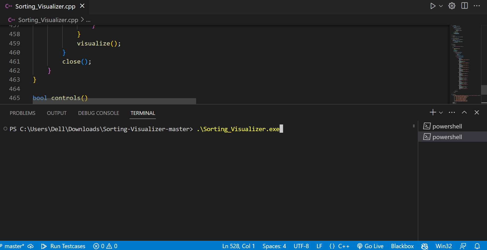
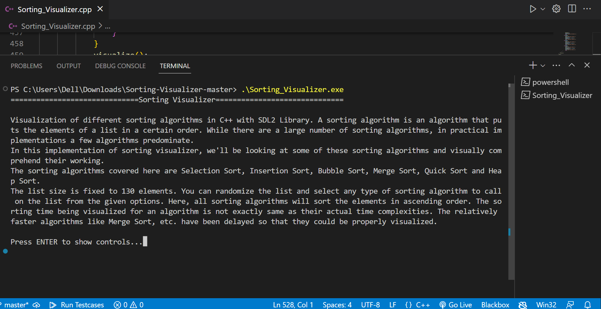
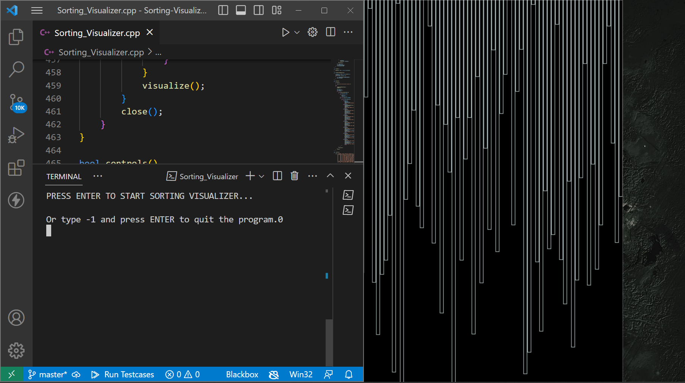
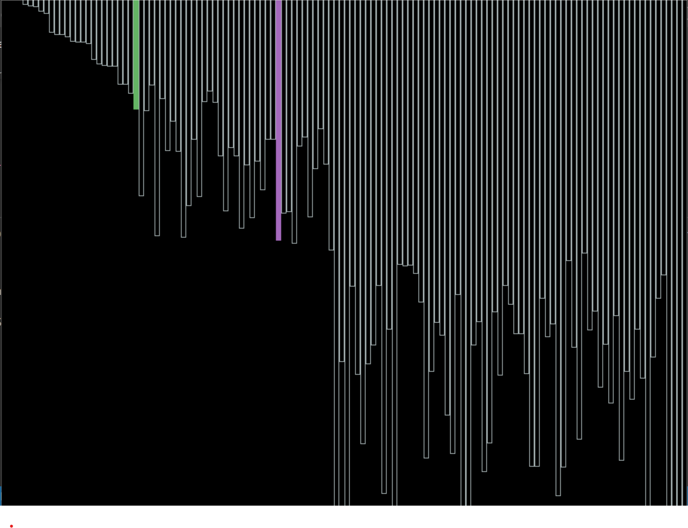
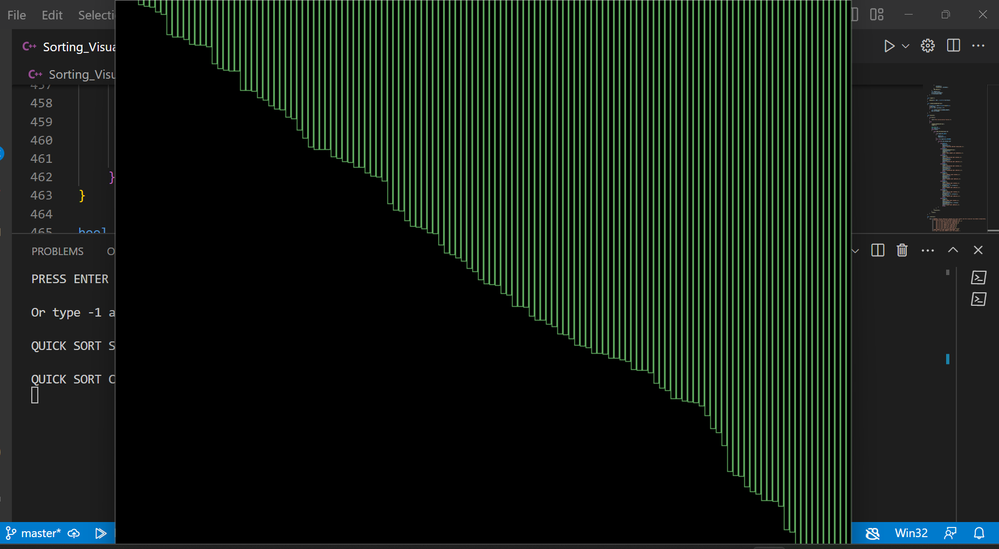

# Sorting-Visualizer
An app that visualizes every sorting algorithm.
# How to run-

 You can run Sorting Visualizer using the C++ source code available in the repository i.e., Sorting Visualizer. cpp but you will need to install and setup the SDL2 library first. So to download it httpsgithub.comlibsdl-orgSDLreleasesdownloadrelease-2.28.2SDL2-devel-2.28.2-VC.zip
             Extract the files in a new folder named SDL in C-drive.

 Set Up SDL library, and edit paths in environment variables.
 
 NOTE-:If you do not want any change in Environment variables you can do 
 if you have a 32-bit os-
            g++ Sorting_Visualizer.cpp -o Sorting_Visualizer -IC:\SDL\SDL2-2.28.2\include -LC:\SDL\SDL2-2.28.2\lib\x86 -lSDL2main -lSDL2 -lmingw32
     or  g++ Sorting_Visualizer.cpp -o Sorting_Visualizer -IC:\SDL\SDL2-2.28.2\include -LC:\SDL\SDL2-2.28.2\lib\x64 -lSDL2main -lSDL2 -lmingw32 
 for 64 Bit OS.
  in terminal.
 
  After this, an executable file will be created which you can run.

NOTE:- 1. It is best to give the next command after the previous one has been completed, in order to minimize latency.
       2. Provide the required option when a new window is opened.
  
# Controls-
Available Controls inside Sorting Visualizer-
- Use 0 to Generate a different randomized list.
- Use 1 to start Selection Sort Algorithm.
- Use 2 to start Insertion Sort Algorithm.
- Use 3 to start Bubble Sort Algorithm.
- Use 4 to start Merge Sort Algorithm.
- Use 5 to start Quick Sort Algorithm.
- Use 6 to start Heap Sort Algorithm.
- Use q to exit out of the Sorting Visualizer

DEMO -:

